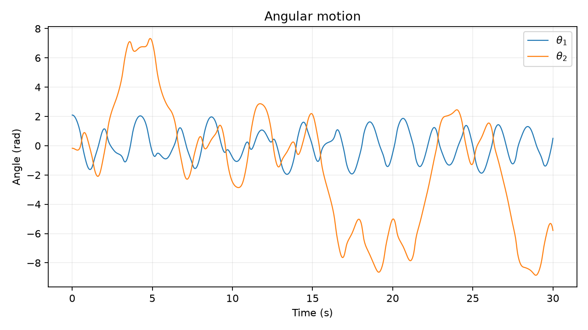
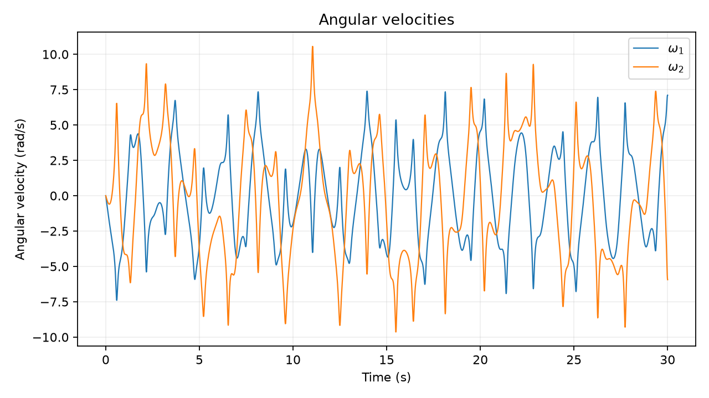
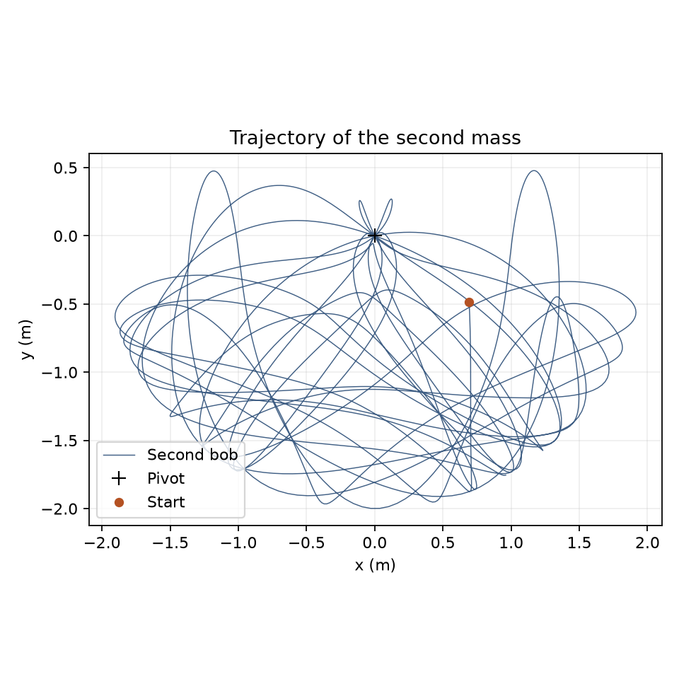
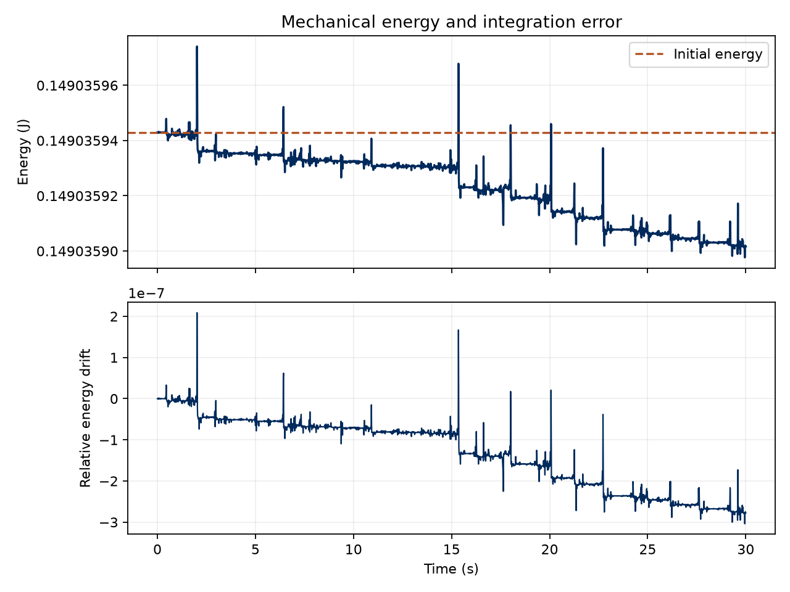
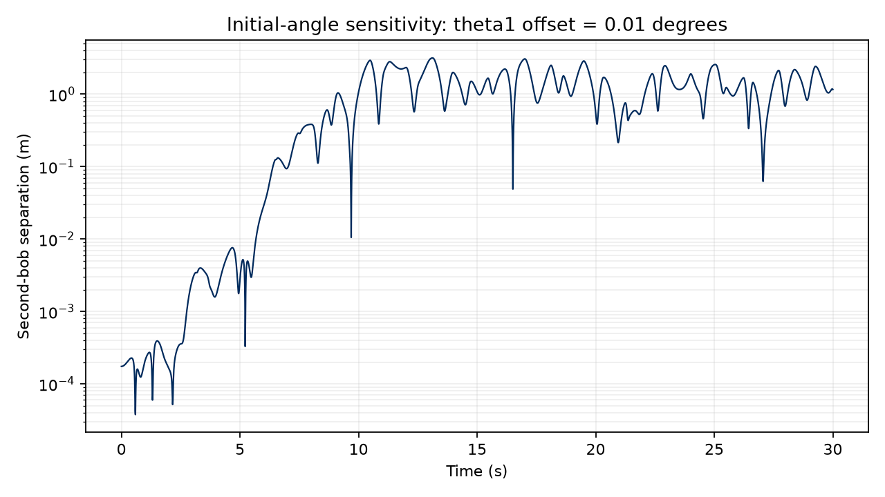

# Double Pendulum Numerical Simulation

> A computational exploration of nonlinear dynamics and chaotic motion using the double pendulum.

**Development:** AI-assisted · Vibe-coded with Codex

## Overview

This project models two point masses joined by massless rigid rods in a vertical plane. A fixed pivot, uniform gravity, and the absence of friction make the ideal system conservative. Its equations are deterministic, yet some initial conditions lead to motion that is highly sensitive to small perturbations. Not every double-pendulum trajectory is chaotic.

The project keeps the physics, numerical experiment, and plotting in separate, readable Python modules. It is an undergraduate learning project, not a claim of formal research experience.

## Physics

Both angles are measured from the **downward vertical**, independently of one another. They are not angles relative to the preceding rod. The pivot is the Cartesian origin, with positive y upward.

| Symbol | Meaning | Internal unit |
| --- | --- | --- |
| $m_1,m_2$ | Point masses | kg |
| $L_1,L_2$ | Rod lengths | m |
| $g$ | Gravitational acceleration | m/s² |
| $\theta_1,\theta_2$ | Absolute rod angles | rad |
| $\omega_1,\omega_2$ | Angular velocities | rad/s |

The geometry is

$$x_1=L_1\sin\theta_1,\qquad y_1=-L_1\cos\theta_1,$$
$$x_2=x_1+L_2\sin\theta_2,\qquad y_2=y_1-L_2\cos\theta_2.$$

Differentiating these coordinates gives the bob velocities. Substitution in $T=\frac12m_1v_1^2+\frac12m_2v_2^2$ gives, with $\delta=\theta_1-\theta_2$,

$$T=\frac12(m_1+m_2)L_1^2\omega_1^2+\frac12m_2L_2^2\omega_2^2+m_2L_1L_2\omega_1\omega_2\cos\delta.$$

Using zero gravitational potential at pivot height,

$$V=-(m_1+m_2)gL_1\cos\theta_1-m_2gL_2\cos\theta_2.$$

For the Lagrangian $\mathcal{L}=T-V$, apply

$$\frac{d}{dt}\frac{\partial\mathcal{L}}{\partial\dot\theta_i}-\frac{\partial\mathcal{L}}{\partial\theta_i}=0.$$

This gives the coupled equations

$$A\ddot\theta_1+B\ddot\theta_2=F_1,\qquad B\ddot\theta_1+C\ddot\theta_2=F_2,$$

where

$$A=(m_1+m_2)L_1^2,\quad B=m_2L_1L_2\cos\delta,\quad C=m_2L_2^2,$$
$$F_1=-m_2L_1L_2\omega_2^2\sin\delta-(m_1+m_2)gL_1\sin\theta_1,$$
$$F_2=m_2L_1L_2\omega_1^2\sin\delta-m_2gL_2\sin\theta_2.$$

Solving these two linear equations for the accelerations gives

$$\ddot\theta_1=\frac{CF_1-BF_2}{D},\qquad\ddot\theta_2=\frac{AF_2-BF_1}{D},$$
$$D=AC-B^2=m_2L_1^2L_2^2(m_1+m_2\sin^2\delta)>0.$$

`derivatives()` implements these expressions directly. The state ordering is
`[theta1, omega1, theta2, omega2]`, so its derivative is
`[omega1, angular_acceleration1, omega2, angular_acceleration2]`.

## Numerical Method

The first-order equations are integrated with SciPy's `solve_ivp`, using the adaptive eighth-order Runge–Kutta method **DOP853**. Defaults are `rtol=1e-10` and `atol=1e-12`. These tolerances control estimated local error, not guaranteed long-term trajectory accuracy.

`--dt` controls the saved output spacing, **not the solver's internal step size**. The code uses `ceil(duration/dt)+1` uniformly spaced samples, including both endpoints. Therefore the actual spacing is at most the requested value. All calculations use SI units; only the CLI angle inputs and perturbation are in degrees.

Total energy is $E=T+V$. Its relative drift is

$$\frac{E(t)-E(0)}{|E(0)|}.$$

DOP853 is not an exactly energy-preserving or symplectic integrator. Finite-step truncation, interpolation, and floating-point errors can cause small drift. Tightening tolerances usually improves accuracy at additional computational cost. Small energy drift is a useful check but does not guarantee a correct long-time chaotic trajectory.

The relative drift depends on the chosen potential-energy zero. If $|E(0)|$ is within $10^{-12}$ of the gravitational energy scale $(m_1+m_2)gL_1+m_2gL_2$, the program reports and plots **absolute drift in joules** instead. It does not divide by zero.

## Results

The included figures were generated with `python main.py`:

| Setting | Default |
| --- | --- |
| Masses / lengths | 1 kg each / 1 m each |
| Gravity | 9.81 m/s² |
| Initial angles | 120° and −10° |
| Initial angular velocities | Both 0 rad/s |
| Duration / output spacing | 30 s / 0.01 s |
| Perturbation in run B | +0.01° in the first angle only |

### Angular motion

Angles remain unwrapped: full rotations are not folded back into a principal interval. Angular velocities show the changing rotational speeds as energy transfers between the bobs.




### Cartesian trajectory

The second bob traces a complicated path. Equal axis scaling preserves the physical geometry.



### Conservation of energy

In the included run, the initial energy is approximately **0.149036 J**, the maximum absolute drift is **4.53 × 10⁻⁸ J**, and the maximum relative drift is **3.04 × 10⁻⁷**. The upper plot intentionally zooms into the small energy variations; the lower plot shows their relative magnitude.



### Sensitivity to initial conditions

The second-bob separation starts at approximately **1.745 × 10⁻⁴ m** and is **1.16 m** after 30 s in the included run. Exact late-time values can vary with solver settings and software versions. `results/summary.json` records the configuration and diagnostics for the most recent run.



## Chaos and Sensitivity

The nonlinear coupling allows small differences to grow substantially in the illustrated regime. Both integrations use the same parameters, sample times, and tolerances. Only the first initial angle changes: **120° versus 120.01°** by default.

We measure $d(t)=\sqrt{(x_{2,B}-x_{2,A})^2+(y_{2,B}-y_{2,A})^2}$. Cartesian separation avoids spurious jumps from angle wrapping. It is a projected distance, rather than a full phase-space norm, and is bounded by $2(L_1+L_2)$. Growth need not be monotonic: trajectories can approach again, and separation eventually saturates at the system's length scale. Exact zeros are masked in the logarithmic plot.

This experiment **illustrates sensitivity; it does not prove chaos or calculate a Lyapunov exponent**. A rigorous exponent estimate requires a defined phase-space metric, repeated perturbation rescaling or variational equations, and convergence studies. To assess numerical contamination, compare tighter solver tolerances over a short time interval; long-time pointwise agreement is not expected indefinitely in a sensitive regime.

## Running the Project

Use Python 3.10 or newer. Open a terminal in `double-pendulum-simulation/`:

```bash
pip install -r requirements.txt
python main.py
```

A virtual environment is recommended. In this workspace, one is already available; on Windows you can run without activation:

```powershell
.\.venv\Scripts\python.exe main.py
```

The default run saves five PNG figures without opening any windows. Files are written relative to the project directory, even if the program is launched from another folder. Rerunning replaces outputs with the same names.

Customize the initial conditions and physical parameters:

```bash
python main.py --theta1 120 --theta2 -10 --omega1 0 --omega2 0 --m1 1 --m2 1 --L1 1 --L2 1 --g 9.81 --duration 30 --dt 0.01
python main.py --perturbation 0.001 --rtol 1e-12 --atol 1e-14 --output-dir results/tighter-run
python main.py --help
```

Changing `--theta1` also changes the baseline for the sensitivity experiment. Run B always adds `--perturbation` to that baseline. Positive, finite masses, lengths, gravity, duration, and sample spacing are required. Finer output spacing and longer durations require more memory.

### Animation

```bash
python main.py --animate
python main.py --save-gif
```

The animation shows the fixed pivot, both rods and bobs, simulation time, and a fading 1.5-second trail. Playback defaults to 30 fps; use `--fps` to change it. It resamples the saved angular data by linear interpolation for display only. Use a small `--dt` for smooth, accurate-looking motion.

`--animate` requires a working Matplotlib GUI backend. GIF export uses Pillow (included in requirements) and works without a GUI. If the GIF writer is unavailable or export fails, static plots and numerical results remain available. Long GIFs can use substantial memory; try a short run first:

```bash
python main.py --duration 3 --save-gif --output-dir results/animation-demo
```

### Files and verification

```text
double-pendulum-simulation/
├── README.md
├── requirements.txt
├── main.py                  # CLI, output files, and orchestration
├── double_pendulum.py       # Equations, integration, coordinates, energy
├── visualization.py         # Five figures and optional animation
├── sensitivity.py           # Nearby-initial-condition experiment
├── verify.py                # Small, independent physics checks
├── .gitignore
├── figures/                 # Generated PNGs used in this README
└── results/
    ├── summary.json         # Parameters, versions, energy and separation metrics
    ├── simulation.npz       # Generated numerical arrays; ignored by Git
    └── double_pendulum.gif  # Only with --save-gif; ignored by Git
```

Run `python verify.py` to check equilibrium, Cartesian geometry and energy, instantaneous energy conservation, short-time tolerance convergence, the actual perturbation, zero-energy handling, and invalid parameters. The tests use Python's built-in `unittest`.

`simulation.npz` contains `time`, `state_a`, `state_b`, `energy_a`, `energy_b`, and `separation`. State arrays have shape `(4, N)` in the documented order. Virtual environments, caches, raw numerical arrays, and GIFs are ignored by Git. The five static figures and summary are intended to accompany the source.

## Technologies

- Python
- NumPy
- SciPy
- Matplotlib
- Pillow for optional GIF export

## Future Improvements

- Estimate the largest Lyapunov exponent with convergence checks.
- Compare numerical integration methods and energy drift.
- Construct Poincaré sections.
- Explore different mass and length ratios.
- Add interactive initial-condition controls.

## Development Note

This project was developed using AI-assisted / vibe coding with Codex, which was used substantially for coding and implementation. I do not claim to have manually written every line of code. The project serves as a student exploration: I use it to run, study, and understand the underlying physics, numerical methods, nonlinear dynamics, and sensitivity to initial conditions.

## References

- [University of Maryland: double-pendulum Lagrangian and equations](https://physics.umd.edu/hep/drew/pendulum2.html).
- [SciPy: solve_ivp methods and error tolerances](https://docs.scipy.org/doc/scipy/reference/generated/scipy.integrate.solve_ivp.html).
